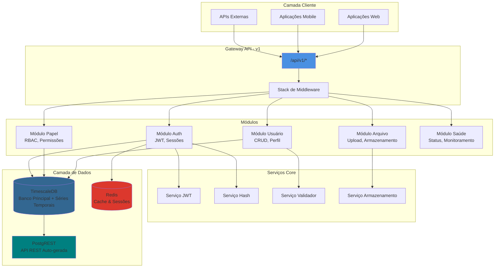
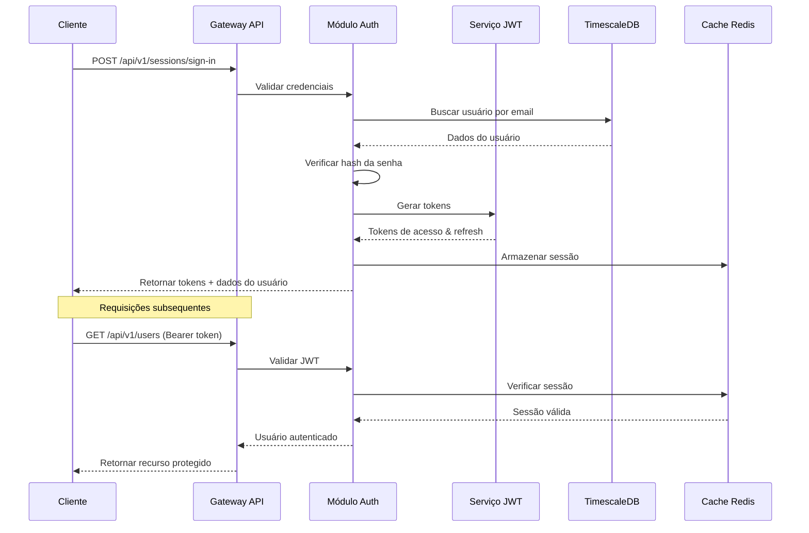
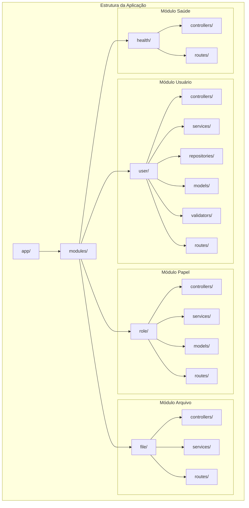
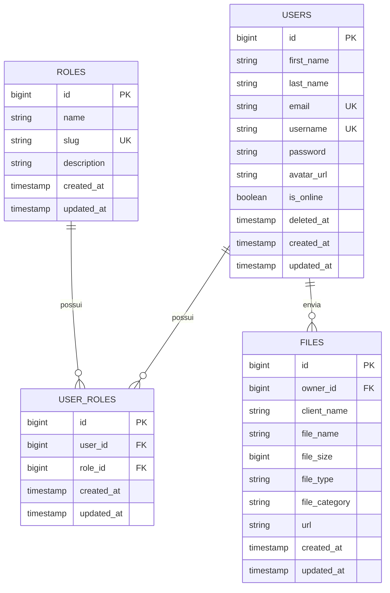
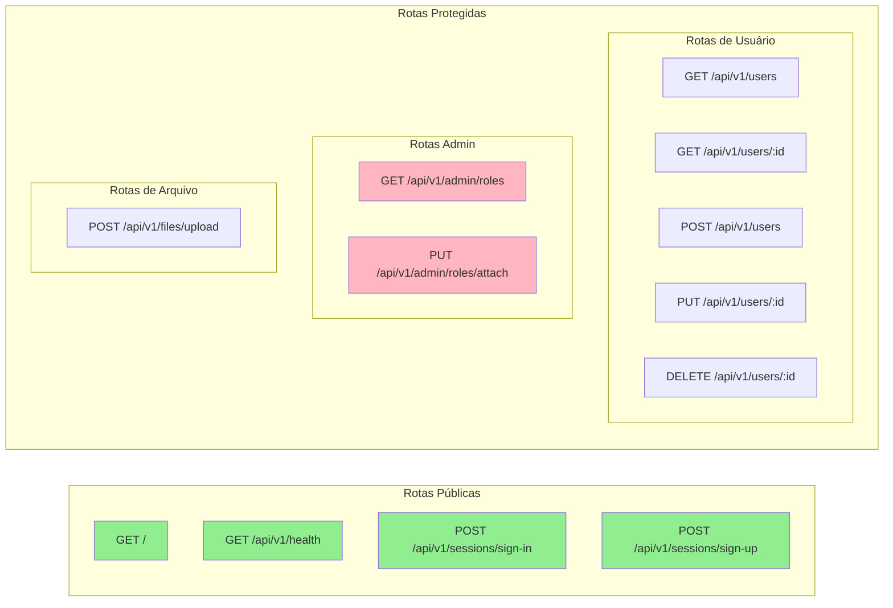
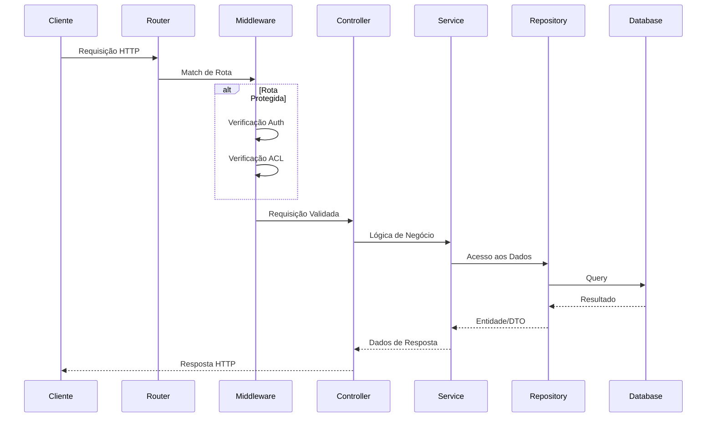

<h1 align="center">
  
</h1>

<p align="center">
  
  
  
  
  
  <a href="https://github.com/gabrielmaialva33/base-rbac-api/commits/master">
    
    
  </a>
</p>

<br>

<p align="center">
    <a href="README.md">English</a>
    ·
    <a href="README-pt.md">Portuguese</a>
</p>

<p align="center">
  <a href="#bookmark-about">Sobre</a>&nbsp;&nbsp;&nbsp;|&nbsp;&nbsp;&nbsp;
  <a href="#computer-technologies">Tecnologias</a>&nbsp;&nbsp;&nbsp;|&nbsp;&nbsp;&nbsp;
  <a href="#wrench-tools">Ferramentas</a>&nbsp;&nbsp;&nbsp;|&nbsp;&nbsp;&nbsp;
  <a href="#package-installation">Instalação</a>&nbsp;&nbsp;&nbsp;|&nbsp;&nbsp;&nbsp;
  <a href="#memo-license">Licença</a>
</p>

<br>

## :bookmark: Sobre

**Base ACL** é uma API modular de controle de acesso construída com AdonisJS v6 que fornece uma base robusta para
autenticação e controle de acesso baseado em papéis. A API segue princípios de arquitetura limpa com clara separação de
responsabilidades e foi projetada para servir como base para múltiplos projetos.

### 🏗️ Visão Geral da Arquitetura



### 🔐 Fluxo de Autenticação



### 📁 Estrutura Modular



## 🌟 Principais Funcionalidades

### Funcionalidades Core

- **🔐 Autenticação JWT**: Autenticação segura baseada em tokens com refresh tokens
- **👥 Controle de Acesso Baseado em Papéis**: Permissões refinadas com papéis ROOT, ADMIN e USER
- **📁 Arquitetura Modular**: Clara separação de responsabilidades com módulos de funcionalidades
- **🗄️ TimescaleDB**: PostgreSQL + capacidades de séries temporais
- **🚀 API RESTful**: Endpoints bem estruturados seguindo princípios REST
- **📤 Upload de Arquivos**: Manipulação segura de arquivos com múltiplos drivers de armazenamento
- **🏥 Monitoramento de Saúde**: Endpoints integrados para verificação de saúde
- **🔒 Segurança em Primeiro Lugar**: Hash de senhas, CORS, rate limiting pronto
- **📝 Validação de Requisições**: DTOs com validação em tempo de execução
- **🌐 Pronto para i18n**: Suporte a internacionalização integrado
- **🔗 Integração PostgREST**: API REST auto-gerada para acesso direto ao banco
- **📊 Suporte a Séries Temporais**: Construído sobre TimescaleDB para análises e métricas

### Esquema do Banco de Dados



<br>

## :computer: Tecnologias

- **[Typescript](https://www.typescriptlang.org/)**
- **[Node.js](https://nodejs.org/)**
- **[AdonisJS](https://adonisjs.com/)**
- **[TimescaleDB](https://www.timescale.com/)** - PostgreSQL para séries temporais
- **[Redis](https://redis.io/)** - Armazenamento de dados em memória
- **[PostgREST](https://postgrest.org/)** - API REST auto-gerada
- **[Docker](https://www.docker.com/)**

<br>

## :wrench: Ferramentas

- **[WebStorm](https://www.jetbrains.com/webstorm/)**
- **[Insomnia](https://insomnia.rest/)**
- **[DataGrip](https://www.jetbrains.com/datagrip/)**

<br>

## :package: Instalação

### :heavy_check_mark: **Pré-requisitos**

Os seguintes softwares devem estar instalados:

- **[Node.js](https://nodejs.org/en/)**
- **[Git](https://git-scm.com/)**
- **[NPM](https://www.npmjs.com/)** or **[Yarn](https://yarnpkg.com/)**
- **[PostgreSQL](https://www.postgresql.org/download/)** or **[Docker](https://www.docker.com/get-started/)**

<br>

### :arrow_down: **Clonando o repositório**

```sh
  $ git clone https://github.com/gabrielmaialva33/base-acl-api.git
```

<br>

### :arrow_forward: **Rodando o backend**

- :package: API

```sh
  $ cd base-acl-api
  # Instalação de dependências.
  $ yarn # ou npm install
  # Configuração ambiente de sistema
  $ cp .env.example .env
  # Criação de banco de dados.
  $ node ace migration:run # ou docker-compose up --build
  # Iniciar API
  $ node ace serve --watch # ou yarn start ou npm dev
```

<br>

## :twisted_rightwards_arrows: Rotas da API

A API é versionada e todos os endpoints são prefixados com `/api/v1/`. Abaixo está a estrutura completa de rotas:

### 🛣️ Organização das Rotas



### 📋 Detalhes das Rotas

| Método     | Endpoint                     | Descrição                  | Auth Obrigatória | Papéis      |
|------------|------------------------------|----------------------------|------------------|-------------|
| **GET**    | `/`                          | Informações da API         | ❌                | -           |
| **GET**    | `/api/v1/health`             | Verificação de saúde       | ❌                | -           |
| **POST**   | `/api/v1/sessions/sign-in`   | Login de usuário           | ❌                | -           |
| **POST**   | `/api/v1/sessions/sign-up`   | Registro de usuário        | ❌                | -           |
| **GET**    | `/api/v1/users`              | Listar usuários (paginado) | ✅                | USER        |
| **GET**    | `/api/v1/users/:id`          | Obter usuário por ID       | ✅                | USER        |
| **POST**   | `/api/v1/users`              | Criar usuário              | ✅                | USER        |
| **PUT**    | `/api/v1/users/:id`          | Atualizar usuário          | ✅                | USER        |
| **DELETE** | `/api/v1/users/:id`          | Deletar usuário            | ✅                | USER        |
| **GET**    | `/api/v1/admin/roles`        | Listar papéis              | ✅                | ROOT, ADMIN |
| **PUT**    | `/api/v1/admin/roles/attach` | Atribuir papel ao usuário  | ✅                | ROOT, ADMIN |
| **POST**   | `/api/v1/files/upload`       | Upload de arquivo          | ✅                | USER        |

### 🔄 Fluxo de Requisição/Resposta



### 📥 Coleção Insomnia

Obtenha a coleção completa da API para o
Insomnia: [Download](https://raw.githubusercontent.com/gabrielmaialva33/base-acl-api/master/.github/assets/insomnia/Insomnia.json.zip)

## :memo: Licença

O projeto está sobre a licença [MIT](./LICENSE) ❤️

Gostou? Deixe uma estrela para ajudar o projeto ⭐

<br>

<p align="center">
  
</p>

<p align="center">
  &copy; 2017-present <a href="https://github.com/gabrielmaialva33/" target="_blank">Maia</a>
</p>
¬
