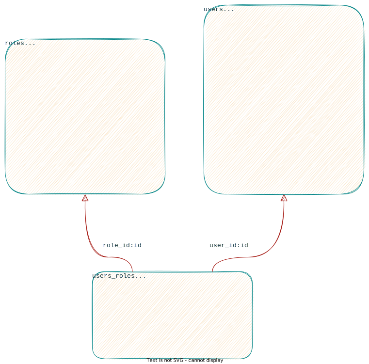

<h1 align="center">
  
</h1>

<p align="center">
  
  
  
  
  
  <a href="https://github.com/gabrielmaialva33/base-rbac-api/commits/master">
    
    
  </a>
</p>

<br>

<p align="center">
    <a href="README.md">English</a>
    ·
    <a href="README-pt.md">Portuguese</a>
</p>

<p align="center">
  <a href="#bookmark-about">Sobre</a>&nbsp;&nbsp;&nbsp;|&nbsp;&nbsp;&nbsp;
  <a href="#computer-technologies">Tecnologias</a>&nbsp;&nbsp;&nbsp;|&nbsp;&nbsp;&nbsp;
  <a href="#wrench-tools">Ferramentas</a>&nbsp;&nbsp;&nbsp;|&nbsp;&nbsp;&nbsp;
  <a href="#package-installation">Instalação</a>&nbsp;&nbsp;&nbsp;|&nbsp;&nbsp;&nbsp;
  <a href="#memo-license">Licença</a>
</p>

<br>

## :bookmark: Sobre

**Base ACL** é uma API base de lista de controle de acesso que espera atender a muitos projetos.

<kbd>
  
</kbd>

<br>

## :computer: Tecnologias

- **[Typescript](https://www.typescriptlang.org/)**
- **[Node.js](https://nodejs.org/)**
- **[AdonisJS](https://adonisjs.com/)**
- **[PostgreSQL](https://www.postgresql.org/)**
- **[Docker](https://www.docker.com/)**

<br>

## :wrench: Ferramentas

- **[WebStorm](https://www.jetbrains.com/webstorm/)**
- **[Insomnia](https://insomnia.rest/)**
- **[DataGrip](https://www.jetbrains.com/datagrip/)**

<br>

## :package: Instalação

### :heavy_check_mark: **Pré-requisitos**

Os seguintes softwares devem estar instalados:

- **[Node.js](https://nodejs.org/en/)**
- **[Git](https://git-scm.com/)**
- **[NPM](https://www.npmjs.com/)** or **[Yarn](https://yarnpkg.com/)**
- **[PostgreSQL](https://www.postgresql.org/download/)** or **[Docker](https://www.docker.com/get-started/)**

<br>

### :arrow_down: **Clonando o repositório**

```sh
  $ git clone https://github.com/gabrielmaialva33/base-acl-api.git
```

<br>

### :arrow_forward: **Rodando o backend**

- :package: API

```sh
  $ cd base-acl-api
  # Instalação de dependências.
  $ yarn # ou npm install
  # Configuração ambiente de sistema
  $ cp .env.example .env
  # Criação de banco de dados.
  $ node ace migration:run # ou docker-compose up --build
  # Iniciar API
  $ node ace serve --watch # ou yarn start ou npm dev
```

<br>

## :twisted_rightwards_arrows: Rotas

Arquivo de
rotas [Donwload](https://raw.githubusercontent.com/gabrielmaialva33/base-acl-api/master/.github/assets/insomnia/Insomnia.json.zip)

## :memo: Licença

O projeto está sobre a licença [MIT](./LICENSE) ❤️

Gostou? Deixe uma estrela para ajudar o projeto ⭐
