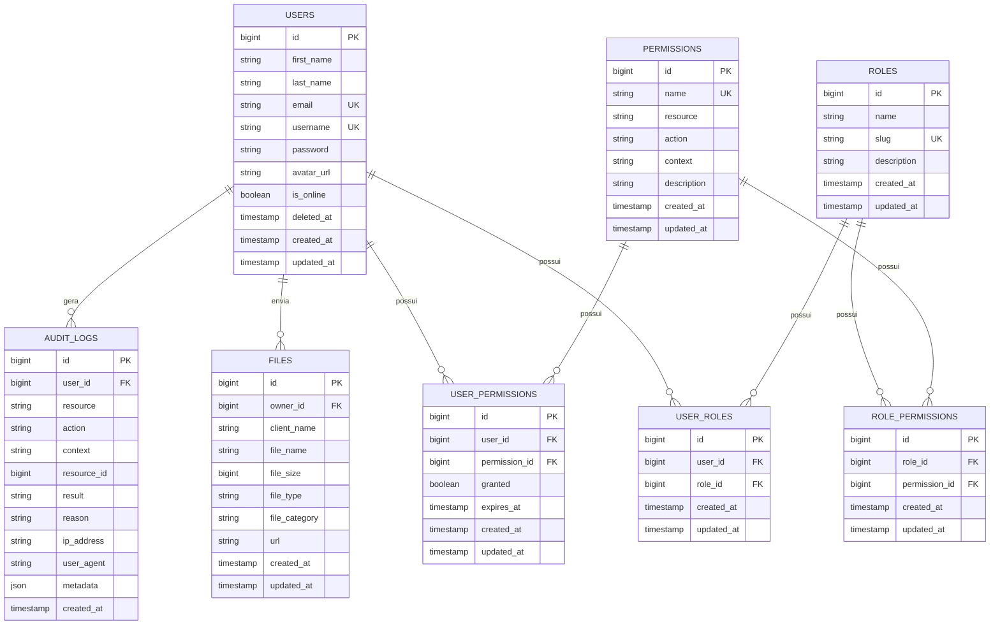

<h1 align="center">
  
</h1>

<p align="center">
  
  
  
  
  
  <a href="https://github.com/gabrielmaialva33/base-rbac-api/commits/master">
    
    
  </a>
</p>

<br>

<p align="center">
    <a href="README.md">English</a>
    ·
    <a href="README-pt.md">Portuguese</a>
</p>

<p align="center">
  <a href="#bookmark-about">Sobre</a>&nbsp;&nbsp;&nbsp;|&nbsp;&nbsp;&nbsp;
  <a href="#computer-technologies">Tecnologias</a>&nbsp;&nbsp;&nbsp;|&nbsp;&nbsp;&nbsp;
  <a href="#wrench-tools">Ferramentas</a>&nbsp;&nbsp;&nbsp;|&nbsp;&nbsp;&nbsp;
  <a href="#package-installation">Instalação</a>&nbsp;&nbsp;&nbsp;|&nbsp;&nbsp;&nbsp;
  <a href="#memo-license">Licença</a>
</p>

<br>

## :bookmark: Sobre

**Base ACL** é uma API modular de controle de acesso construída com AdonisJS v6 que fornece uma base robusta para
autenticação e controle de acesso baseado em papéis. A API segue princípios de arquitetura limpa com clara separação de
responsabilidades e foi projetada para servir como base para múltiplos projetos.

### 🏗️ Visão Geral da Arquitetura

```mermaid
graph TB
    subgraph "Camada Cliente"
        WEB[Aplicações Web]
        MOB[Aplicações Mobile]
        API[APIs Externas]
    end

    subgraph "Gateway API - v1"
        ROUTES["/api/v1/*"]
        MW[Stack de Middleware]
    end

    subgraph "Módulos"
        AUTH[Módulo Auth<br/>JWT, Sessões]
        USER[Módulo Usuário<br/>CRUD, Perfil]
        ROLE[Módulo Papel<br/>RBAC, Hierarquia]
        PERM[Módulo Permissão<br/>Contextual, Herança]
        FILE[Módulo Arquivo<br/>Upload, Armazenamento]
        AUDIT[Módulo Auditoria<br/>Logs, Analytics]
        HEALTH[Módulo Saúde<br/>Status, Monitoramento]
    end

    subgraph "Serviços Core"
        JWT[Serviço JWT]
        HASH[Serviço Hash]
        VALIDATOR[Serviço Validador]
        STORAGE[Serviço Armazenamento]
    end

    subgraph "Camada de Dados"
        TS[(PostgreSQL<br/>Banco Principal)]
        REDIS[(Redis<br/>Cache & Sessões)]
        PGREST[PostgREST<br/>API REST Auto-gerada]
    end

    WEB --> ROUTES
    MOB --> ROUTES
    API --> ROUTES

    ROUTES --> MW
    MW --> AUTH
    MW --> USER
    MW --> ROLE
    MW --> PERM
    MW --> FILE
    MW --> AUDIT
    MW --> HEALTH

    AUTH --> JWT
    AUTH --> HASH
    USER --> VALIDATOR
    FILE --> STORAGE
    PERM --> REDIS
    AUDIT --> TS

    USER --> TS
    ROLE --> TS
    PERM --> TS
    AUTH --> TS
    AUTH --> REDIS
    AUDIT --> TS

    TS --> PGREST

    style ROUTES fill:#4A90E2
    style TS fill:#336791
    style REDIS fill:#DC382D
    style PGREST fill:#008080
```



### 🔐 Fluxo de Autenticação

```mermaid
sequenceDiagram
    participant C as Cliente
    participant API as Gateway API
    participant AUTH as Módulo Auth
    participant JWT as Serviço JWT
    participant DB as PostgreSQL
    participant REDIS as Cache Redis

    C->>API: POST /api/v1/sessions/sign-in
    API->>AUTH: Validar credenciais
    AUTH->>DB: Buscar usuário por email
    DB-->>AUTH: Dados do usuário
    AUTH->>AUTH: Verificar hash da senha
    AUTH->>JWT: Gerar tokens
    JWT-->>AUTH: Tokens de acesso & refresh
    AUTH->>REDIS: Armazenar sessão
    AUTH-->>C: Retornar tokens + dados do usuário

    Note over C,API: Requisições subsequentes

    C->>API: GET /api/v1/users (Bearer token)
    API->>AUTH: Validar JWT
    AUTH->>REDIS: Verificar sessão
    REDIS-->>AUTH: Sessão válida
    AUTH-->>API: Usuário autenticado
    API-->>C: Retornar recurso protegido
```



### 📁 Estrutura Modular

```mermaid
graph TD
    subgraph "Estrutura da Aplicação"
        APP[app/]
        MODULES[modules/]

        subgraph "Módulo Usuário"
            USER_M[user/]
        end
        subgraph "Módulo Papel"
            ROLE_M[role/]
        end
        subgraph "Módulo Permissão"
            PERM_M[permission/]
        end
        subgraph "Módulo Arquivo"
            FILE_M[file/]
        end
        subgraph "Módulo Auditoria"
            AUDIT_M[audit/]
        end
        subgraph "Módulo Saúde"
            HEALTH_M[health/]
        end
        subgraph "Módulo Propriedade"
            OWNER_M[ownership/]
        end
    end

    APP --> MODULES
    MODULES --> USER_M
    MODULES --> ROLE_M
    MODULES --> PERM_M
    MODULES --> FILE_M
    MODULES --> AUDIT_M
    MODULES --> HEALTH_M
    MODULES --> OWNER_M
```



## 🌟 Principais Funcionalidades

### Funcionalidades Core

- **🔐 Autenticação JWT**: Autenticação segura baseada em tokens com refresh tokens
- **👥 Controle de Acesso Baseado em Papéis**: Permissões refinadas com papéis ROOT, ADMIN, USER, EDITOR e GUEST
- **📁 Arquitetura Modular**: Clara separação de responsabilidades com módulos de funcionalidades
- **🗄️ PostgreSQL**: Banco de dados robusto e confiável
- **🚀 API RESTful**: Endpoints bem estruturados seguindo princípios REST
- **📤 Upload de Arquivos**: Manipulação segura de arquivos com múltiplos drivers de armazenamento
- **🏥 Monitoramento de Saúde**: Endpoints integrados para verificação de saúde
- **🔒 Segurança em Primeiro Lugar**: Hash de senhas, CORS, rate limiting pronto
- **📝 Validação de Requisições**: DTOs com validação em tempo de execução
- **🌐 Pronto para i18n**: Suporte a internacionalização integrado
- **🔗 Integração PostgREST**: API REST auto-gerada para acesso direto ao banco

### Funcionalidades Avançadas de ACL

- **🎯 Permissões Contextuais**: Suporte para contextos `own`, `any`, `team` e `department`
- **🔄 Herança de Permissões**: Herança automática de permissões através da hierarquia de papéis
- **📋 Trilha de Auditoria Completa**: Rastreamento de todas as verificações de permissão e tentativas de acesso
- **⚡ Permissões em Cache Redis**: Verificação de permissões de alta performance com cache inteligente
- **🏢 Propriedade de Recursos**: Sistema de propriedade integrado com suporte a contextos de equipe e departamento
- **🔍 Controle Granular de Permissões**: Sistema de permissões baseado em Recurso + Ação + Contexto

### Esquema do Banco de Dados



<br>

## :computer: Tecnologias

- **[Typescript](https://www.typescriptlang.org/)**
- **[Node.js](https://nodejs.org/)**
- **[AdonisJS](https://adonisjs.com/)**
- **[PostgreSQL](https://www.postgresql.org/)**
- **[Redis](https://redis.io/)** - Armazenamento de dados em memória
- **[PostgREST](https://postgrest.org/)** - API REST auto-gerada
- **[Docker](https://www.docker.com/)**

<br>

## :wrench: Ferramentas

- **[WebStorm](https://www.jetbrains.com/webstorm/)**
- **[Insomnia](https://insomnia.rest/)**
- **[DataGrip](https://www.jetbrains.com/datagrip/)**

<br>

## :package: Instalação

### :heavy_check_mark: **Pré-requisitos**

Os seguintes softwares devem estar instalados:

- **[Node.js](https://nodejs.org/en/)**
- **[Git](https://git-scm.com/)**
- **[NPM](https://www.npmjs.com/)** or **[Yarn](https://yarnpkg.com/)**
- **[PostgreSQL](https://www.postgresql.org/download/)** or **[Docker](https://www.docker.com/get-started/)**

<br>

### :arrow_down: **Clonando o repositório**

```sh
  $ git clone https://github.com/gabrielmaialva33/base-acl-api.git
```

<br>

### :arrow_forward: **Rodando o backend**

- :package: API

```sh
  $ cd base-acl-api
  # Instalação de dependências.
  $ yarn # ou npm install
  # Configuração ambiente de sistema
  $ cp .env.example .env
  # Criação de banco de dados.
  $ node ace migration:run # ou docker-compose up --build
  # Iniciar API
  $ node ace serve --hmr # ou pnpm dev
```

<br>

## :twisted_rightwards_arrows: Rotas da API

A API é versionada e todos os endpoints são prefixados com `/api/v1/`. Abaixo está a estrutura completa de rotas:

### 🛣️ Organização das Rotas


### 📋 Detalhes das Rotas

| Método     | Endpoint                                    | Descrição                           | Auth Obrigatória | Permissão/Papel    |
| ---------- | ------------------------------------------- | ----------------------------------- | ---------------- | ------------------ |
| **GET**    | `/`                                         | Informações da API                  | ❌               | -                  |
| **GET**    | `/api/v1/health`                            | Verificação de saúde                | ❌               | -                  |
| **POST**   | `/api/v1/sessions/sign-in`                  | Login de usuário                    | ❌               | -                  |
| **POST**   | `/api/v1/sessions/sign-up`                  | Registro de usuário                 | ❌               | -                  |
| **GET**    | `/api/v1/verify-email`                      | Verificar email do usuário          | ❌               | -                  |
| **POST**   | `/api/v1/resend-verification-email`         | Reenviar email de verificação       | ✅               | -                  |
| **GET**    | `/api/v1/me`                                | Obter perfil do usuário atual       | ✅               | -                  |
| **GET**    | `/api/v1/me/permissions`                    | Obter permissões do usuário atual   | ✅               | -                  |
| **GET**    | `/api/v1/me/roles`                          | Obter papéis do usuário atual       | ✅               | -                  |
| **GET**    | `/api/v1/users`                             | Listar usuários (paginado)          | ✅               | users.list         |
| **GET**    | `/api/v1/users/:id`                         | Obter usuário por ID                | ✅               | users.read         |
| **POST**   | `/api/v1/users`                             | Criar usuário                       | ✅               | users.create       |
| **PUT**    | `/api/v1/users/:id`                         | Atualizar usuário                   | ✅               | users.update       |
| **DELETE** | `/api/v1/users/:id`                         | Deletar usuário                     | ✅               | users.delete       |
| **GET**    | `/api/v1/admin/roles`                       | Listar papéis                       | ✅               | ROOT, ADMIN        |
| **PUT**    | `/api/v1/admin/roles/attach`                | Atribuir papel ao usuário           | ✅               | ROOT, ADMIN        |
| **GET**    | `/api/v1/admin/permissions`                 | Listar permissões                   | ✅               | permissions.list   |
| **POST**   | `/api/v1/admin/permissions`                 | Criar permissão                     | ✅               | permissions.create |
| **PUT**    | `/api/v1/admin/roles/permissions/sync`      | Sincronizar permissões do papel     | ✅               | permissions.update |
| **PUT**    | `/api/v1/admin/roles/permissions/attach`    | Anexar permissões ao papel          | ✅               | permissions.update |
| **PUT**    | `/api/v1/admin/roles/permissions/detach`    | Desanexar permissões do papel       | ✅               | permissions.update |
| **PUT**    | `/api/v1/admin/users/permissions/sync`      | Sincronizar permissões do usuário   | ✅               | permissions.update |
| **GET**    | `/api/v1/admin/users/:id/permissions`       | Obter permissões diretas do usuário | ✅               | permissions.list   |
| **POST**   | `/api/v1/admin/users/:id/permissions/check` | Verificar permissões do usuário     | ✅               | permissions.list   |
| **POST**   | `/api/v1/files/upload`                      | Upload de arquivo                   | ✅               | files.create       |

### 🔄 Fluxo de Requisição/Resposta

```mermaid
sequenceDiagram
    participant Cliente
    participant Router
    participant Middleware
    participant Controller
    participant Service
    participant Repository
    participant Database

    Cliente->>Router: Requisição HTTP
    Router->>Middleware: Match de Rota

    alt Rota Protegida
        Middleware->>Middleware: Verificação Auth
        Middleware->>Middleware: Verificação ACL
    end

    Middleware->>Controller: Requisição Validada
    Controller->>Service: Lógica de Negócio
    Service->>Repository: Acesso aos Dados
    Repository->>Database: Query
    Database-->>Repository: Resultado
    Repository-->>Service: Entidade/DTO
    Service-->>Controller: Dados de Resposta
    Controller-->>Cliente: Resposta HTTP
```



### 🔐 Sistema de Permissões

O sistema avançado de permissões suporta controle de acesso contextual:

```mermaid
graph TD
    subgraph "Estrutura de Permissão"
        P[Permissão]
        P --> R[Recurso]
        P --> A[Ação]
        P --> C[Contexto]

        R --> |exemplos| R1[users]
        R --> |exemplos| R2[files]
        R --> |exemplos| R3[permissions]

        A --> |exemplos| A1[create]
        A --> |exemplos| A2[read]
        A --> |exemplos| A3[update]
        A --> |exemplos| A4[delete]
        A --> |exemplos| A5[list]

        C --> |exemplos| C1[own - Apenas recursos próprios]
        C --> |exemplos| C2[any - Qualquer recurso]
        C --> |exemplos| C3[team - Recursos da equipe]
        C --> |exemplos| C4[department - Recursos do departamento]
    end
```



#### Hierarquia de Papéis e Herança

```
ROOT
├── ADMIN (herda todas as permissões ROOT)
│   ├── USER (herda permissões básicas ADMIN)
│   │   └── GUEST (herda permissões limitadas USER)
│   └── EDITOR (herda permissões de conteúdo ADMIN)
       └── USER (herda de EDITOR)
```

#### Exemplos de Contexto

- `users.update.own` - Pode atualizar apenas o próprio perfil
- `users.update.any` - Pode atualizar qualquer usuário
- `files.delete.team` - Pode deletar arquivos de membros da equipe
- `reports.read.department` - Pode ler relatórios do próprio departamento

### 📥 Coleção Insomnia

Obtenha a coleção completa da API para o
Insomnia: [Download](https://raw.githubusercontent.com/gabrielmaialva33/base-acl-api/master/.github/assets/insomnia/Insomnia.json.zip)

## :memo: Licença

O projeto está sobre a licença [MIT](./LICENSE) ❤️

Gostou? Deixe uma estrela para ajudar o projeto ⭐

<br>

<p align="center">
  
</p>

<p align="center">
  &copy; 2017-present <a href="https://github.com/gabrielmaialva33/" target="_blank">Maia</a>
</p>
