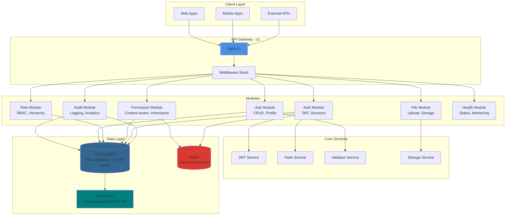
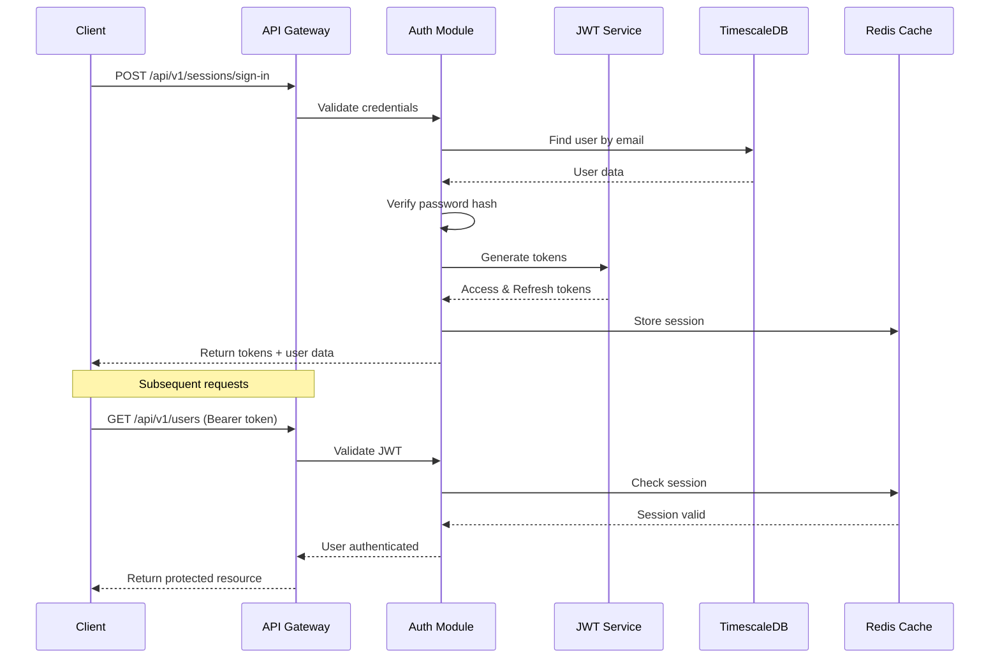
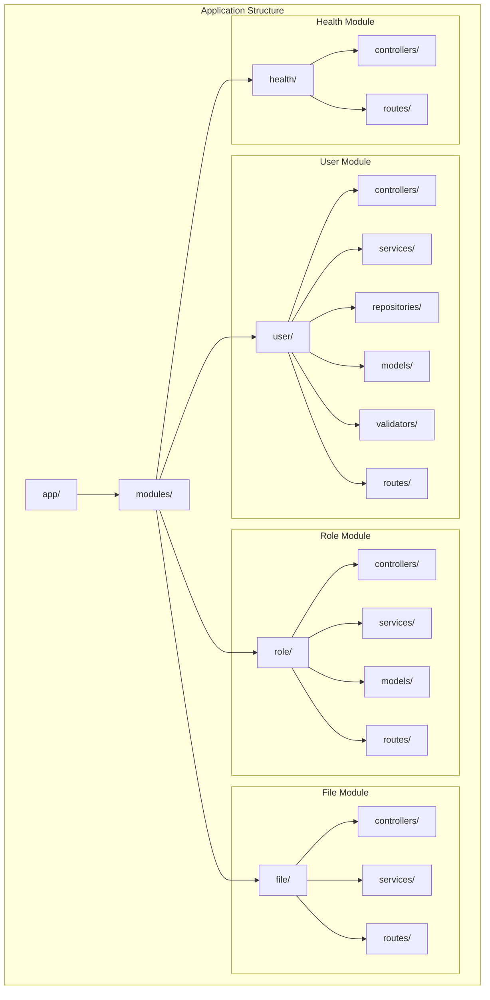
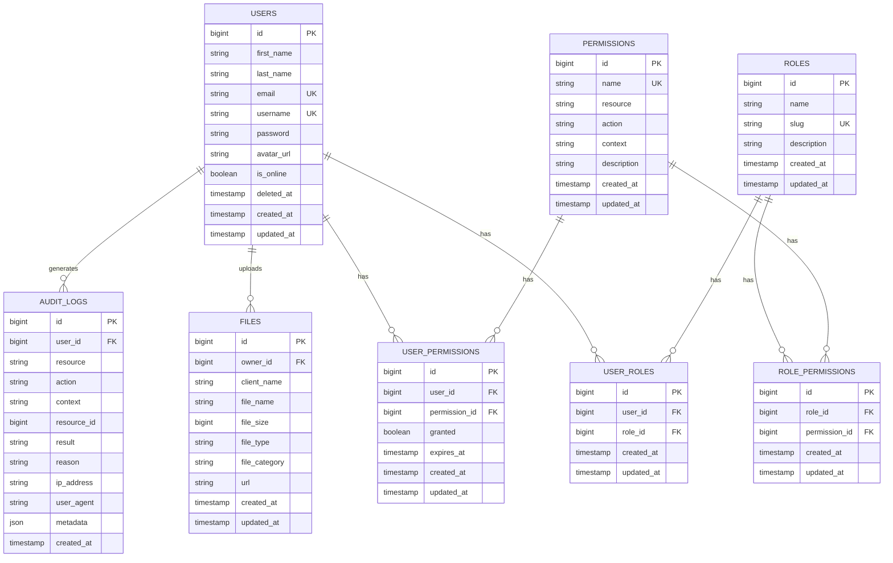
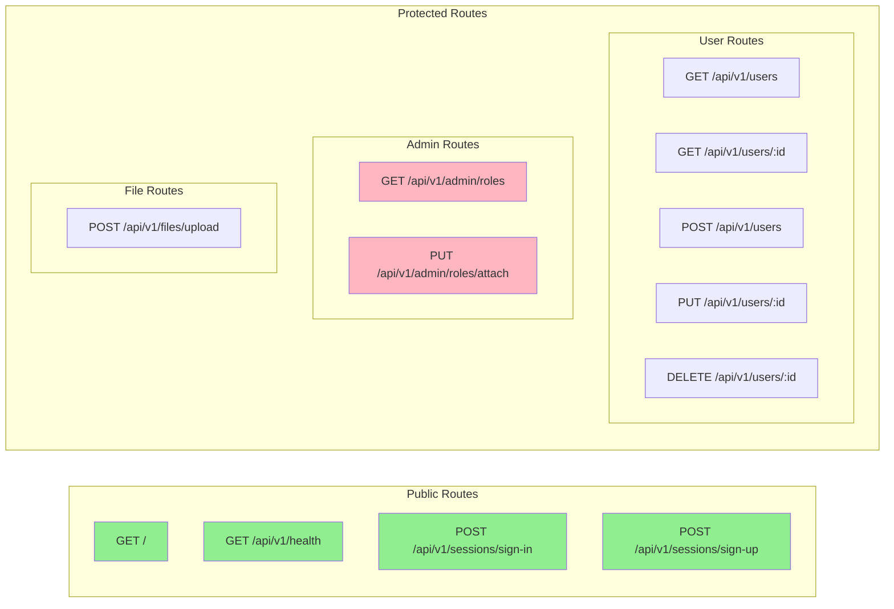
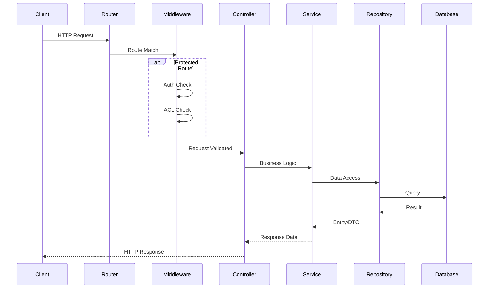
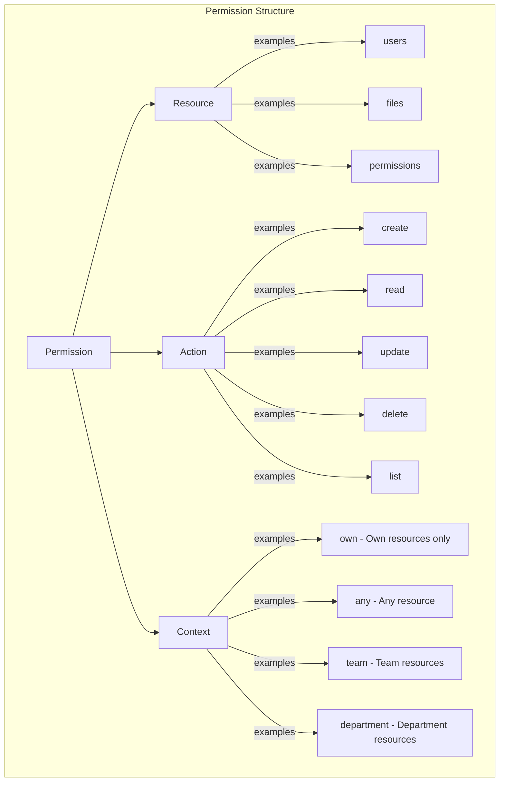

<h1 align="center">
  
</h1>

<p align="center">
  
  
  
  
  
  <a href="https://github.com/gabrielmaialva33/base-acl-api/commits/master">
    
      
  </a>
</p>

<br>

<p align="center">
    <a href="README.md">English</a>
    ·
    <a href="README-pt.md">Portuguese</a>
</p>

<p align="center">
  <a href="#bookmark-about">About</a>&nbsp;&nbsp;&nbsp;|&nbsp;&nbsp;&nbsp;
  <a href="#computer-technologies">Technologies</a>&nbsp;&nbsp;&nbsp;|&nbsp;&nbsp;&nbsp;
  <a href="#wrench-tools">Tools</a>&nbsp;&nbsp;&nbsp;|&nbsp;&nbsp;&nbsp;
  <a href="#package-installation">Installation</a>&nbsp;&nbsp;&nbsp;|&nbsp;&nbsp;&nbsp;
  <a href="#memo-license">License</a>
</p>

<br>

## :bookmark: About

**Base ACL** is a modular access control list API built with AdonisJS v6 that provides a robust foundation for
authentication and role-based access control. The API follows clean architecture principles with clear separation of
concerns and is designed to serve as a base for multiple projects.

### 🏗️ Architecture Overview



### 🔐 Authentication Flow



### 📁 Module Structure



## 🌟 Key Features

### Core Features

- **🔐 JWT Authentication**: Secure token-based authentication with refresh tokens
- **👥 Role-Based Access Control**: Fine-grained permissions with ROOT, ADMIN, USER, EDITOR, and GUEST roles
- **📁 Modular Architecture**: Clean separation of concerns with feature modules
- **🗄️ TimescaleDB**: PostgreSQL + time-series data capabilities
- **🚀 RESTful API**: Well-structured endpoints following REST principles
- **📤 File Uploads**: Secure file handling with multiple storage drivers
- **🏥 Health Monitoring**: Built-in health check endpoints
- **🔒 Security First**: Password hashing, CORS, rate limiting ready
- **📝 Request Validation**: DTOs with runtime validation
- **🌐 i18n Ready**: Internationalization support built-in
- **🔗 PostgREST Integration**: Auto-generated REST API for direct database access
- **📊 Time-series Support**: Built on TimescaleDB for analytics and metrics

### Advanced ACL Features

- **🎯 Context-Aware Permissions**: Support for `own`, `any`, `team`, and `department` contexts
- **🔄 Permission Inheritance**: Automatic permission inheritance through role hierarchy
- **📋 Comprehensive Audit Trail**: Track all permission checks and access attempts
- **⚡ Redis-Cached Permissions**: High-performance permission checking with intelligent caching
- **🏢 Resource Ownership**: Built-in ownership system supporting team and department contexts
- **🔍 Granular Permission Control**: Resource + Action + Context based permission system

### Database Schema



<br>

## :computer: Technologies

- **[Typescript](https://www.typescriptlang.org/)**
- **[Node.js](https://nodejs.org/)**
- **[AdonisJS](https://adonisjs.com/)**
- **[TimescaleDB](https://www.timescale.com/)** - PostgreSQL for time-series
- **[Redis](https://redis.io/)** - In-memory data store
- **[PostgREST](https://postgrest.org/)** - Auto-generated REST API
- **[Docker](https://www.docker.com/)**

<br>

## :wrench: Tools

- **[WebStorm](https://www.jetbrains.com/webstorm/)**
- **[Insomnia](https://insomnia.rest/)**
- **[DataGrip](https://www.jetbrains.com/datagrip/)**

<br>

## :package: Installation

### :heavy_check_mark: **Prerequisites**

The following software must be installed:

- **[Node.js](https://nodejs.org/en/)**
- **[Git](https://git-scm.com/)**
- **[NPM](https://www.npmjs.com/)** or **[Yarn](https://yarnpkg.com/)**
- **[PostgreSQL](https://www.postgresql.org/download/)** or **[Docker](https://www.docker.com/get-started/)**

<br>

### :arrow_down: **Cloning the repository**

```sh
  $ git clone https://github.com/gabrielmaialva33/base-acl-api.git
```

<br>

### :arrow_forward: **Running the application**

- :package: API

```sh
  $ cd base-acl-api
  # Dependencies install.
  $ yarn # or npm install
  # Config environment system
  $ cp .env.example .env
  # Data base creation.
  $ node ace migration:run # or docker-compose up --build
  # API start
  $ node ace serve --watch # or yarn dev or npm dev
```

<br>

## :twisted_rightwards_arrows: API Routes

The API is versioned and all endpoints are prefixed with `/api/v1/`. Below is the complete route structure:

### 🛣️ Route Organization



### 📋 Route Details

| Method     | Endpoint                               | Description                  | Auth Required | Permission/Role     |
| ---------- | -------------------------------------- | ---------------------------- | ------------- | ------------------- |
| **GET**    | `/`                                    | API information              | ❌            | -                   |
| **GET**    | `/api/v1/health`                       | Health check                 | ❌            | -                   |
| **POST**   | `/api/v1/sessions/sign-in`             | User login                   | ❌            | -                   |
| **POST**   | `/api/v1/sessions/sign-up`             | User registration            | ❌            | -                   |
| **GET**    | `/api/v1/me`                           | Get current user profile     | ✅            | -                   |
| **GET**    | `/api/v1/me/permissions`               | Get current user permissions | ✅            | -                   |
| **GET**    | `/api/v1/me/roles`                     | Get current user roles       | ✅            | -                   |
| **GET**    | `/api/v1/users`                        | List users (paginated)       | ✅            | users.list          |
| **GET**    | `/api/v1/users/:id`                    | Get user by ID               | ✅            | users.read          |
| **POST**   | `/api/v1/users`                        | Create user                  | ✅            | users.create        |
| **PUT**    | `/api/v1/users/:id`                    | Update user                  | ✅            | users.update        |
| **DELETE** | `/api/v1/users/:id`                    | Delete user                  | ✅            | users.delete        |
| **GET**    | `/api/v1/admin/roles`                  | List roles                   | ✅            | ROOT, ADMIN         |
| **PUT**    | `/api/v1/admin/roles/attach`           | Attach role to user          | ✅            | ROOT, ADMIN         |
| **GET**    | `/api/v1/admin/permissions`            | List permissions             | ✅            | permissions.list    |
| **POST**   | `/api/v1/admin/permissions`            | Create permission            | ✅            | permissions.create  |
| **PUT**    | `/api/v1/admin/roles/permissions/sync` | Sync role permissions        | ✅            | permissions.update  |
| **POST**   | `/api/v1/files/upload`                 | Upload file                  | ✅            | files.create        |

### 🔄 Request/Response Flow



### 🔐 Permission System

The advanced permission system supports context-aware access control:



#### Role Hierarchy & Inheritance

```
ROOT
├── ADMIN (inherits all ROOT permissions)
│   ├── USER (inherits basic ADMIN permissions)
│   │   └── GUEST (inherits limited USER permissions)
│   └── EDITOR (inherits content ADMIN permissions)
       └── USER (inherits from EDITOR)
```

#### Context Examples

- `users.update.own` - Can only update own profile
- `users.update.any` - Can update any user
- `files.delete.team` - Can delete files from team members
- `reports.read.department` - Can read reports from own department

### 📥 Postman Collection

Get the complete API collection for
Postman: [Download](https://raw.githubusercontent.com/gabrielmaialva33/base-acl-api/master/docs/openapi.yaml)

## :memo: License

This project is under the **MIT** license. [MIT](./LICENSE) ❤️

Liked? Leave a little star to help the project ⭐

<br>

<p align="center">
  
</p>

<p align="center">
  &copy; 2017-present <a href="https://github.com/gabrielmaialva33/" target="_blank">Maia</a>
</p>
